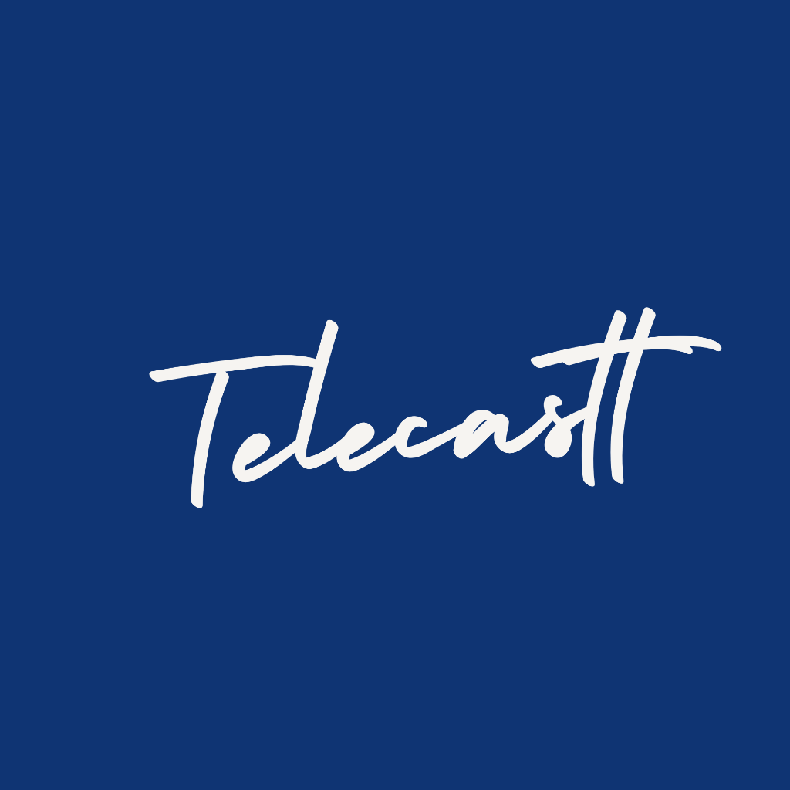

<div align="center">
  
  
  <p><strong>Enterprise-Grade Ultra-Low Latency Virtual Monitor via WebRTC</strong></p>

  [](#)
  [](#)
  [](#)
  [](#)
  [](#)
</div>

---

## Overview

Telecastt is a high-performance WebRTC application engineered to seamlessly extend a Windows desktop environment to any browser-enabled device. 

By leveraging native OS-level EDID spoofing combined with hardware-accelerated WebRTC and a zero-jitter-buffer architecture, Telecastt delivers performance that rivals physical hardware connections: supporting up to 4K resolutions at 144Hz with imperceptible latency.

## Architecture

- **Zero-Latency WebRTC Pipeline:** Aggressively bypasses conventional WebRTC jitter buffers (`playoutDelayHint = 0`) to render frames instantaneously.
- **Hardware-Accelerated Capture:** Utilizes strict `resizeMode: "none"` constraints to prevent browser-level downscaling, enforcing hardware encoder prioritization (H.264/VP8).
- **Automated IDD Provisioning:** Includes a robust PowerShell deployment script for seamless installation and configuration of an open-source Windows Indirect Display Driver (IDD).
- **Secure Signaling:** A lightweight, pure-WebSocket Node.js signaling server utilizing Cryptographically Secure Pseudorandom Number Generators (CSPRNG) for room authentication.

## Installation & Deployment

### 1. Virtual Display Provisioning (Windows Host)
Telecastt requires a virtual monitor to extend the desktop environment.
1. Launch PowerShell with **Administrator privileges**.
2. Execute the provisioning script:
   ```powershell
   .\scripts\Install-VirtualMonitor.ps1
   ```
3. Navigate to **Windows Display Settings**, select **Extend these displays**, and configure the virtual monitor to your required resolution and refresh rate (supports up to 4K / 144Hz).

### 2. Signaling Server Deployment
The Node.js WebSocket server is required to broker the peer-to-peer connection.
```bash
cd backend
npm install
npm start
```

### 3. Client Interface Deployment
```bash
cd frontend
npm install
npm run dev
```

### 4. Connection Protocol
1. On the **Host Machine**, navigate to `http://localhost:5173`. Click **Share Display** and select the designated Virtual Monitor.
2. A secure 6-character room code will be generated.
3. On the **Client Device**, navigate to the Host's local network IP address (e.g., `http://192.168.1.50:5173`), authenticate with the room code, and initiate the stream.

## License
Distributed under the MIT License.
